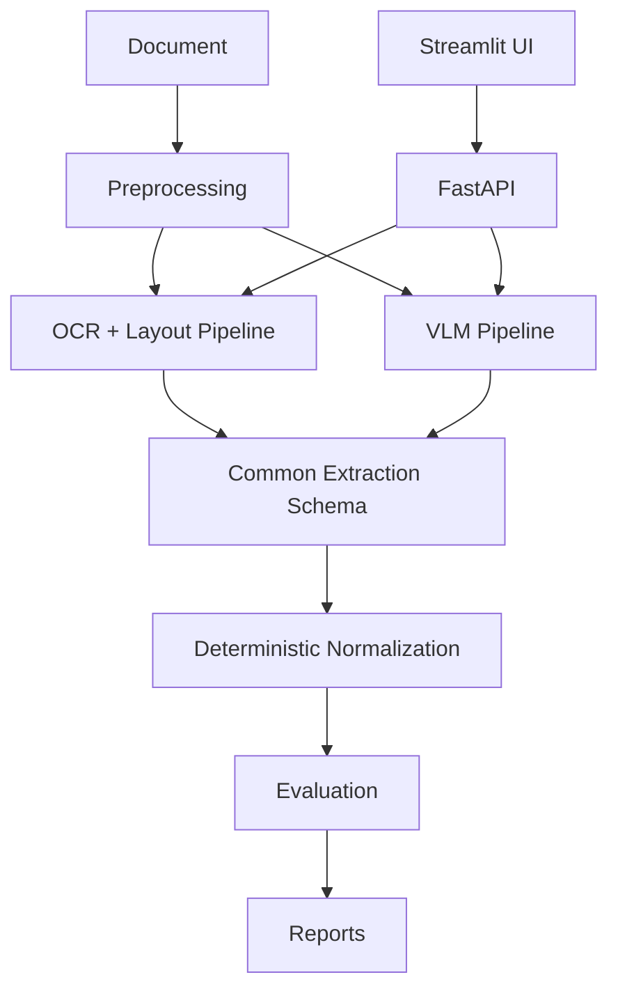

# Architecture

Processors are isolated behind a common `DocumentResult` contract. API and UI code do not own extraction logic. VLM weights are optional and external to the default container image; CPU-only tests use fakes and malformed-output fixtures.
