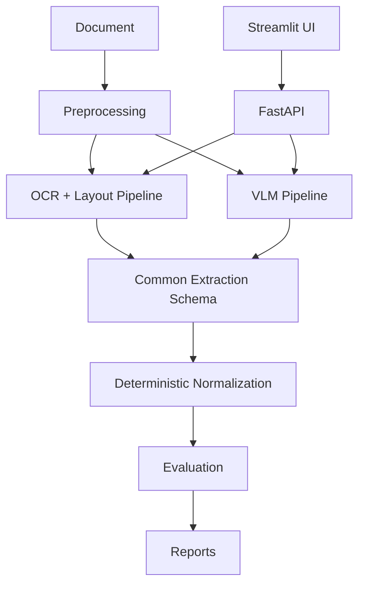
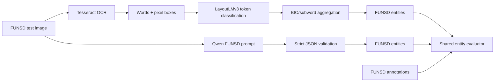

# Architecture

## FUNSD experiment

Processors are isolated behind a common `DocumentResult` contract. FUNSD entities are carried in `DocumentResult.metadata["funsd_entities"]`; generic fields and tables remain separate. Both pipelines use the official test split and are evaluated by the same entity matcher. VLM weights and LayoutLMv3 checkpoints are optional and external to the default container image; CPU-only tests use fakes and mocked outputs.
